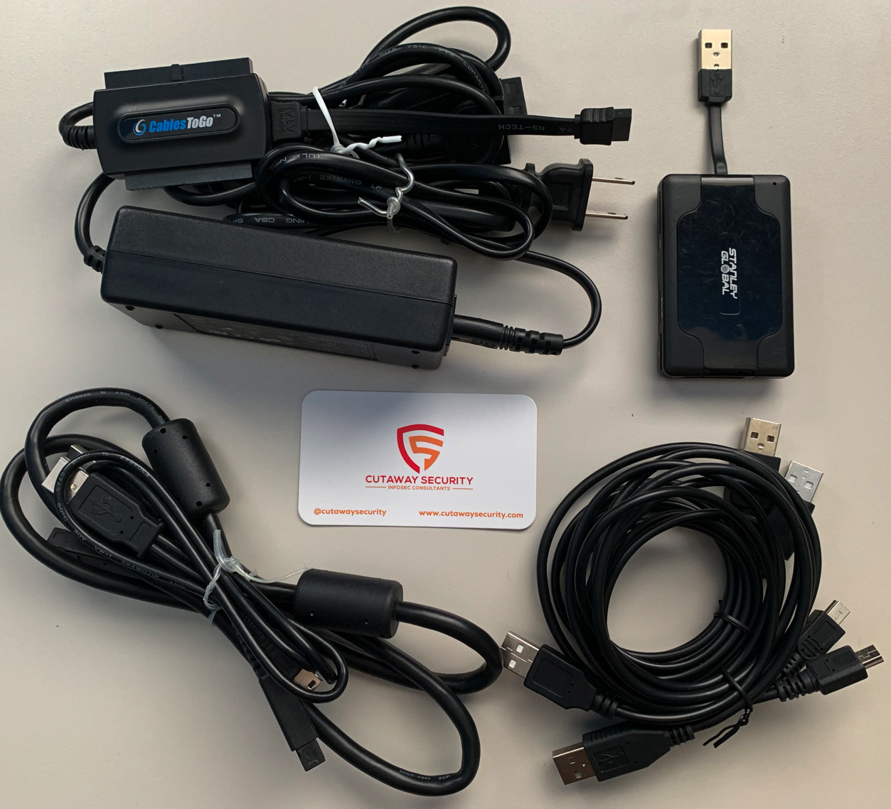

# Forensic Assessment Kit

The Forensic Assessment Kit (FAK) stores tools and equipment to assist with data acquisition and forensic assessments. Data acquisition and forensic assessments require tools that are specialized to the media on which the data is stored. The following kits are a generic list to get people started.

* [FAK: Basic Remote Assessment](./README.md#fak-basic-forensic-assessment)
  * [FAK: Basic Forensics Future Upgrades Wishlist](./README.md#fak-basic-forensics-future-upgrades-wishlist)

NOTE: Equipment changes over time. It is natural that that some of the equipment listed in these kits will be dated and, possibly, discontinued. Equipment is useful until new functionality is required or something more consistent is identified. All kits should be viewed as good starting points.

# FAK: Basic Forensic Assessment

| Equipment | Vendor | Model | Description | Quantity | Cost* | Note |
| :--- | :--- | :--- | :--- | :---: | :---: | :--- |
| [Mobile Smart Card and Multimemory Reader USB 3-Port Hub](https://stanleyglobaltech.com/products/sgt121.html) | Stanley Global | SGT121 | The SGT121 is the Swiss Army Knife of Smart Card Readers.  Combines USB 3-port hub, 39-In-one flash memory reader/writer, phone SIM Card reader/writer/editor with the industry-standard Stanley Global CAC Smart Card Reader.  | 1 | $17 | This is typically not optional. May or may not come with lead wires. __NOT A WRITE BLOCKER__|
| [USB 2.0 to IDE or Serial ATA Drive Adapter Cable](https://www.cablestogo.com/product/30504/33in-usb-2.0-to-ide-or-serial-ata-drive-adapter-cable) | Cables To Go | 30504 | 33in USB 2.0 to IDE or Serial ATA Drive Adapter Cable Externally connect one 2.5in, 3.5in or 5.25in IDE/ATAPI or SATA drive to your computer via USB 2.0!  | 1 | $40 | I got this during a SANS class YEARS ago. USB 2.0 is NOT the way to go. This needs an update. __NOT A WRITE BLOCKER__|

\* Cost on 2019/08/01

## FAK: Basic Forensics Future Upgrades Wishlist

* [FIDECO USB 3.0 to SATA Adapter Hard Drvie Converter IDE Cable](https://www.amazon.com/dp/B077N2KK27/ref=sspa_dk_detail_2?psc=1&pd_rd_i=B077N2KK27) - USB 3 to 3.5 and 2.5 IDE or Serial ATA Drive  __NOT A WRITE BLOCKER__ - $25