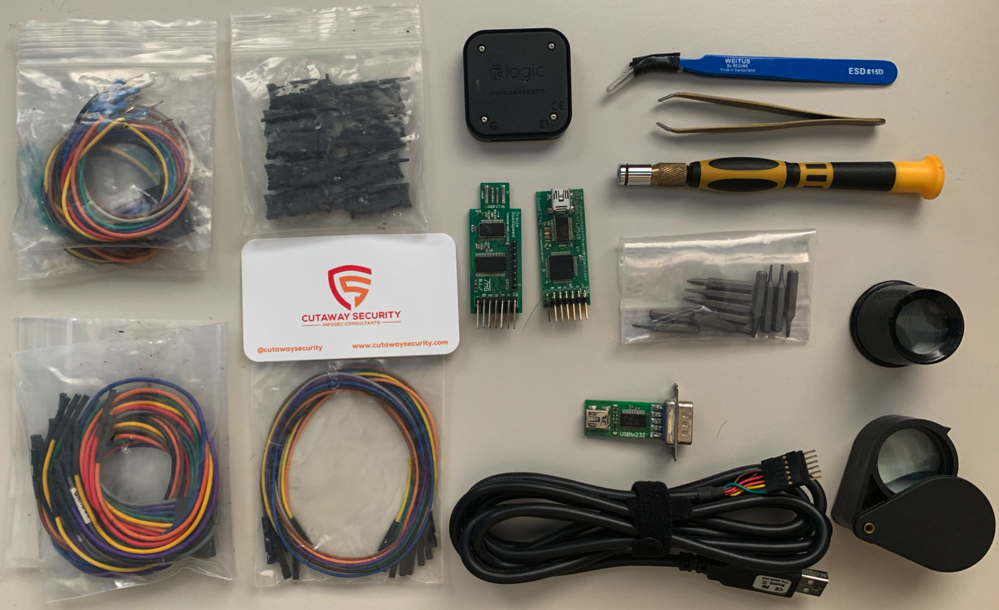

# Hardware Assessment kit
The Hardware Assessment Kit (KAT) stores tools and equipment to assist with hardware assessments. Tools for hardware assessments can get rather large and bulky, such as chip debuggers or multimeters. Thus the equipment will vary by the components involved with the assessment. Use project scoping time to understand the types of hardware interfaces and components (i.e. microcontrollers and memory) that will be evaluated. The following kits are a generic list to get people started.

* [HAK - Multimeter](./README.md#hak-multimeter)
* [HAK - Basic Hardware Component Interactions](./README.md#hak-basic)

# [HAK - Multimeter](#hak-multimeter)
The multimeter is a critical part of any assessment. This device provides the capability to interact with an embedded device's components. Typical actions include testing if the device is energized and tracing leads from component-to-component and debug-pins-to-components.

| Equipment | Vendor | Model | Description | Quantity | Cost* | Note |
| :--- | :--- | :--- | :---: | :---: | :---: | :--- |
| [Extech EX330 Multimeter](http://www.extech.com/display/?id=14823) | Extech | EX330 | Multimeter to understand voltages, connectivity, and tone-out leads. | 1 | $51 | This is typically not optional. May or may not come with lead wires. |
| [Multimeter Electronic Test Lead Kit](https://www.amazon.com/Extech-TL809-Electronic-Test-Lead/dp/B0012VWUI6) | Extech | TL809 | Leads are the wires used with the multimeter | 1 | $17 | The normal posts are necessary and the alligator clips are extremely valuable to use with smaller bits of wire for probing. |
| [Hook-up Wire Spool - Red](https://www.sparkfun.com/products/8865) | Sparkfun | PRT-08865 | Hook-up Wire | 1 | $3 | Red to use with red multimeter lead. Just put a small six to twelve inch piece in case with leads. Store spool with equipment or in another kit. |
| [Hook-up Wire Spool - Black](https://www.sparkfun.com/products/8867) | Sparkfun | PRT-08867 | Hook-up Wire | 1 | $3 |  Black to use with black multimeter lead. Just put a small six to twelve inch piece in case with leads. Store spool with equipment or in another kit. |
| [Voltage Tester](https://www.amazon.com/Circuit-Tester-110-460-Reinforced-Katzco/dp/B01EMAOCTS) | Katzco | 743841487806 | Katzco Circuit Tester- 110-460 Volts 4 Way Circuit Tester, Ideal for AC and CD- Multi Voltage Current Tester- Reinforced casing and Test Leads | 1 | $8 | For quickly testing outlets and other power sources. |

\* Cost on 2019/08/01

# [HAK - Basic Hardware Component Interactions](#hak-basic)
This will list the basic equipment, wire, tools, and other things needed to help to conduct a hardware assessment.

| Equipment | Vendor | Model | Description | Quantity | Cost* | Note |
| :--- | :--- | :--- | :---: | :---: | :---: | :--- |
| [Saleae Logic 8 Logical Analyzer](https://www.saleae.com) | Saleae | Logic8 | Logic analyzer to understand data in motion. | 1 | $400 | There are cheaper logic analyzers on the market. However, Saleae provides excellent customer support. The devices can handle up-to +/- 25 Volts and the warrenty may help you if you short the device. |
| [Goodfet42](http://goodfet.sourceforge.net/hardware/goodfet42/) | Goodfet | 42 | Multi-purpose open source debugger. | 2 | $100 | You can assemble upto four (4) boards yourself for less than $100, and it is a great exercise and makes you a Good Neighbor. You can also order [GoodFETT v42 by Travis Goodspeed](https://www.adafruit.com/product/1279) from AdaFruit. |
| [FTDI Serial TTL-232 USB Cable](https://www.adafruit.com/product/70) | Adafruit | 70 | Serial-to-USB cable | 1 | $18 | Interact with serial devices via USB serial / comm port.  |
| [7" Male to Male Jumper Wires - 30 Count](https://www.sparkfun.com/products/11026) | Sparkfun | PRT-11026 | Jumper wires for various needs | 1 | $3 | N/A |
| [6" Male to Female Jumper Wires - 10 Count](https://www.sparkfun.com/products/9140) | Sparkfun | PRT-9140 | Jumper wires for various needs | 1 | $4 |  N/A |
| [6" Female to Female Jumper Wires - 10 Count](https://www.sparkfun.com/products/11710) | Sparkfun | PRT-11710 | Jumper wires for various needs | 1 | $6 |  N/A |
| [Magnification Loupe](https://www.amazon.com/Beileshi-Magnification-Jewelry-Magnifier-Magnifying/dp/B00KFDB6Z0) | Beileshi | MG21011A | 40x magnification loupe | 1 | $8 | Helpful for quick looks. Cell phone cameras work just as well. |
| [Fine-Tipped Curved Tweesers](https://www.sparkfun.com/products/10602) | Sparkfun | PRT-10602 | Tweesers for gripping small-sized components. | 1 | $4 | Extremely helpful when soldering and removing components from curcuit boards. Fine-tip helps with consistent control of small components. |
| [Slant Tweesers](https://www.amazon.com/Slant-Tweezers-TweezerGuru-Professional-Stainless/dp/B016LI8E4S?th=1) | Tweeser Guru | tweesers | Tweesers for gripping medium-sized components. | 1 | $10 | Extremely helpful when soldering and removing components from curcuit boards. Fine-tip can be hard to work with on larger components.|
| [Screwdriver Set](https://www.sparkfun.com/products/15003) | Sparkfun | PRT-15003 | Small bit screwdriver set | 1 | $7 | Smaller bits are helpful when working with embedded devices. The case may be too large for some cases. Breaking this down into a small bag can save space. |

\* Cost on 2019/08/01

