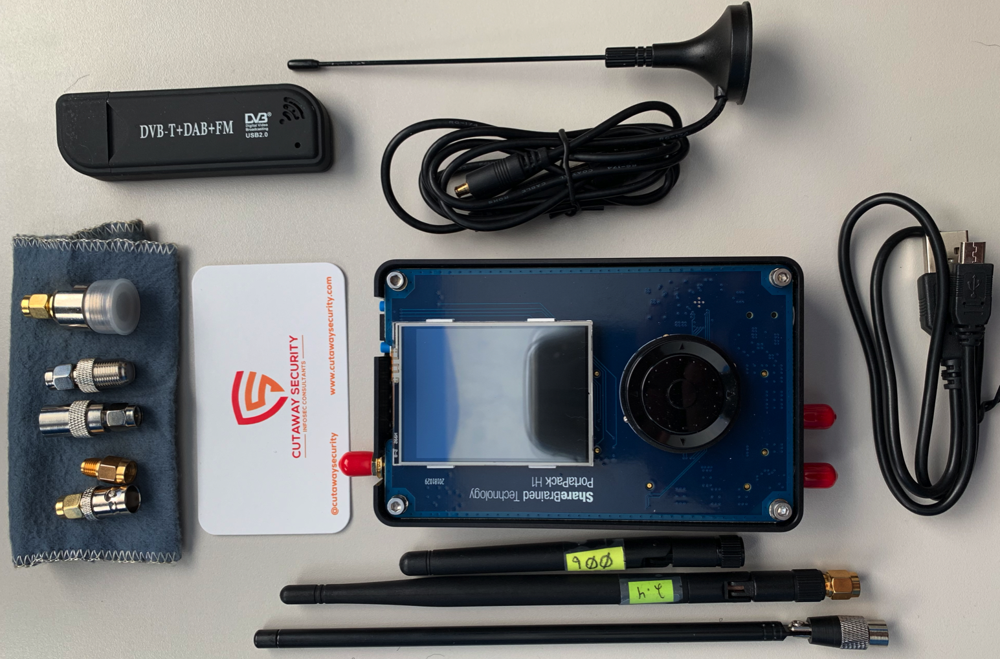
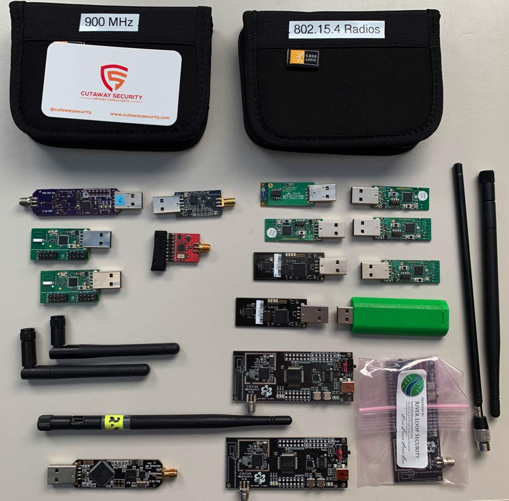

# Radio Assessment Kit
The Radio Assessment Kit (RAK) stores tools and equipment to assist with radio and wireless network assessments. Radio assessments can involve a gambit of implementations. The tools required need to help locate radio transmissions, identify implementation, capture transmissions, and support interaction with the wireless network. The following kits are a generic list to get people started.

* [RAK: Basic Radio Assessment](./README.md#rak-basic-radio-assessment)
  * [RAK: Basic Radio Future Upgrades Wishlist](./README.md#rak-basic-radio-future-upgrades-wishlist)
* [RAK: 802.15.4 Bluetooth Radio Assessment](./README.md#rak-802.15.4-bluetooth-radio-assessment) <- Link is broken, please scroll down.
  * [RAK: 802.15.4 Bluetooth Future Upgrades Wishlist](./README.md#rak-802.15.4-bluetooth-radio-future-upgrades-wishlist) <- Link is broken, please scroll down.

NOTE: Equipment changes over time. It is natural that that some of the equipment listed in these kits will be dated and, possibly, discontinued. Equipment is useful until new functionality is required or something more consistent is identified. All kits should be viewed as good starting points.

# RAK: Basic Radio Assessment
This kit is currently under construction.

| Equipment | Vendor | Model | Description | Quantity | Cost* | Note |
| :--- | :--- | :--- | :--- | :---: | :---: | :--- |
| [HackRF One](https://greatscottgadgets.com/hackrf/one/) | [Great Scott Gadgets](https://greatscottgadgets.com/) | HackRF One | Open source radio designed by Mike Ossman and his team. Excellent for software define radio and custom projects. | 1 | $300 | A full kit with [HackRF One, ANT500 antenna, and 4 SMA adapters](https://www.amazon.com/NooElec-Software-Defined-Antenna-Adapter/dp/B01K1CCHR0) is available from NooElec for $320. |
| [ANT500 Antenna](https://www.adafruit.com/product/3584) | [Share Brained Technology](https://www.sharebrained.com/) | PortaPac | Display, hard case, and controls for [HackRF One](https://greatscottgadgets.com/hackrf/one/) | 1 | $220 | Very useful to locate signals and demodulate know broadcast protocols. |
| [PortaPack for HackRF One](https://store.sharebrained.com/products/portapack-for-hackrf-one-kit) | [Great Scott Gadgets](https://greatscottgadgets.com/) | ANT500 | Adjustable antenna | 1 | $30 | Sometimes this is cheaper if you get it with a HackRF One kit. |
| [RTL2832U+R820T DVB-T USB Digital TV Tuner Receiver](https://www.newegg.com/p/117-006M-00024?item=9SIAFS976P9497) | YKS | RTL2832U+R820T | RTL-SDR to use with GnuRadio and other software define radio. | 1 | $11 | Older, but still useful, RTL-SDR. |

\* Cost on 2019/08/01

## RAK: Basic Radio Future Upgrades Wishlist
* [RTL-SDR Blog R820T2 RTL2832U](https://www.amazon.com/RTL-SDR-Blog-RTL2832U-Software-Defined/dp/B0129EBDS2) - this version of the RTL-SDR is a more up-to-date version and has better shielding. We use this in the [ControlThings.io Accessing and Exploiting Control Systems](https://www.controlthings.io/training) class.

# RAK: 802.15.4 Bluetooth Radio Assessment
This kit is currently under construction.

| Equipment | Vendor | Model | Description | Quantity | Cost* | Note |
| :--- | :--- | :--- | :--- | :---: | :---: | :--- |
| [APIMote - for ZigBee sniffing and transmission](https://www.attify-store.com/products/apimote-for-zigbee-sniffing-and-transmission) | [Riverloop](https://www.riverloopsecurity.com/) | [APIMote](https://www.riverloopsecurity.com/projects/apimote/) | The ApiMote v4beta version is __beta hardware__ intended for students, researchers, engineers, and security professionals to use for learning about and evaluating the security of IEEE 802.15.4/ZigBee systems. | 3 | $150 | Riverloop maintains the [KillerBee](https://www.riverloopsecurity.com/projects/killerbee/) project and has also developed the [APIMote](https://www.riverloopsecurity.com/projects/apimote/) to be more flexible for 802.15.4-based implementations. |
| [Atmel ATAVRRZUSBSTICK](https://www.mouser.com/ProductDetail/Microchip-Technology-Atmel/ATAVRRZUSBSTICK?qs=txwRF2uft8wSedIxfUdhAA%3D%3D) | Microchip Technology | ATAVRRZUSBSTICK | Dongle originally used by KillerBee project. | 3 | Discontinued | I tried to find where to buy these, but was unsuccessful with a quick search. |
| [Ubertooth One](https://greatscottgadgets.com/ubertoothone/) | [Great Scott Gadgets](https://greatscottgadgets.com/) | Ubertooth One | Open source radio designed by Mike Ossman and his team. Excellent for bluetooth and BTLE research and assessments. | 1 | $118 | N/A |
| [Yard Stick One](https://greatscottgadgets.com/yardstickone/) | [Great Scott Gadgets](https://greatscottgadgets.com/) | Yard Stick One | YARD Stick One (Yet Another Radio Dongle) can transmit or receive digital wireless signals at frequencies below 1 GHz.  | 1 | $100 | This is an upgrade from the [TI CC1111EMK868-915](http://www.ti.com/tool/CC1111EMK868-915). Comes flashed with [RfCat](https://github.com/atlas0fd00m/rfcat).|
| [CC1111 USB Evaluation Module Kit 868/915](http://www.ti.com/tool/CC1111EMK868-915) | Texas Instruments | CC1111EMK868-915 | The CC1111EMK868-915 USB dongle makes it easy to have a direct connection between a PC and a sub-1 GHz network based on compatible radios, like the CC1101, CC1120, CC1110, and CC430.  | 2 | $75 | The original dongle, often referred to as Don's Dongle, used by [atlas](https://twitter.com/at1as) to develop and run the radio research tool [RfCat](https://github.com/atlas0fd00m/rfcat). While this is useful for testing and research, the [Yard Stick One](https://greatscottgadgets.com/yardstickone/) is currently a better choice. |
| [CrazyRadio PA](https://www.bitcraze.io/crazyradio-pa/) | BitCraze | CrazyRadio PA | Crazyradio PA is a long range open USB radio dongle based on the nRF24LU1+ from Nordic Semiconductor. | 1 | $30 | This radio was used by the [MouseJack](https://www.mousejack.com/) project. |
| [CC2531 USB Evaluation Module Kit](http://www.ti.com/tool/CC2531EMK) | Texas Instruments | CC2531 | The CC2531EMK kit provides one CC2531 USB Dongle and documentation to support a PC interface to 802.15.4 / ZigBee applications.  | 2 | $50 | For testing and development. |
| [CC2540 USB Evaluation Module Kit](http://www.ti.com/tool/CC2540EMK-USB) | Texas Instruments | CC2540EMK-USB | The CC2540 USB Evaluation Module Kit contains one CC2540 Bluetooth low energy USB Dongle.  | 2 | $50 | For testing and development. |
| [XStick USB Adapter, 802.15.4 and ZigBee](https://www.digi.com/products/networking/rf-adapters-modems/xstick) | Digi | XU-A11 | USB plug-and-play USB to XBee Network Adapter. Available in Zigbee mesh (ZB) & multipoint (802.15.4) variants.  | 1 | $48 | For testing and development. |
| [SparkFun Transceiver Breakout - nRF24L01+](https://www.sparkfun.com/products/705) | Sparkfun | WRL-00705 | This module uses the 2.4GHz transceiver from Nordic Semiconductor, the nRF24L01+. This transceiver IC operates in the 2.4GHz band.  | 1 | $22 | For testing and development. Also useful for wireless keyboard sniffing via [Travis Goodspeed: Promiscuity is the nRF24L01+'s Duty](http://travisgoodspeed.blogspot.com/2011/02/promiscuity-is-nrf24l01s-duty.html). Sadly, I had that HOPE badge, but I fried it learning to solder. |
| [Case Logic JDS-6 USB Drive Shuttle 6-Capacity-Black](https://www.amazon.com/Case-Logic-JDS-6-Shuttle-6-Capacity-Black/dp/B0009Y7AX2) | Case Logic | JDS-6 | USB Thumb Drive Case | 2 | $8 | Cases to protect USB-style radio dongles |

\* Cost on 2019/08/01

## RAK: 802.15.4 Bluetooth Radio Future Upgrades Wishlist
* [Parani-UD100 Bluetooth 4.0 Class1 USB Adapter](http://www.senanetworks.com/ud100-g03.html?sc=14&category=3968) - to augment the [Ubertooth One](https://greatscottgadgets.com/ubertoothone/) for research, testing, and interactions with Bluetooth and BTLE.