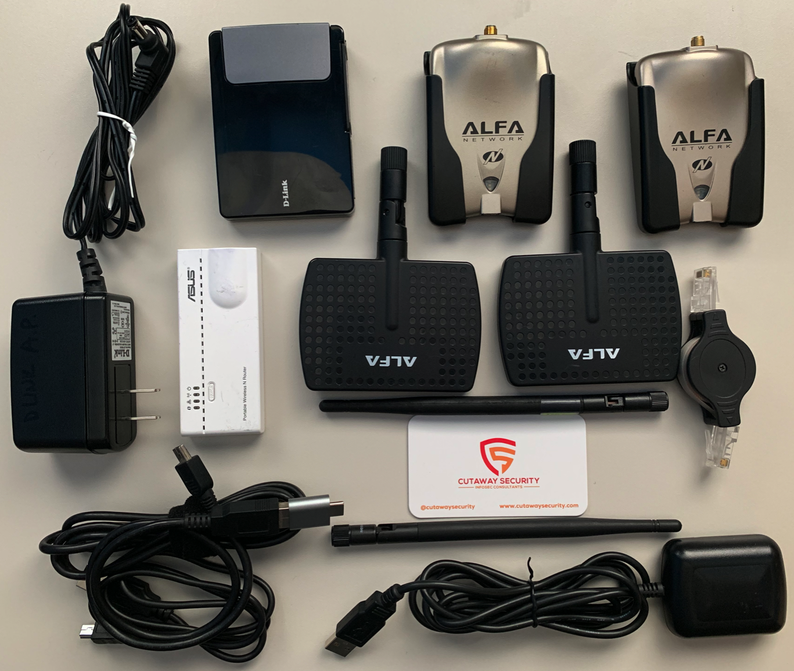

# Wi-Fi Assessment Kit

The Wi-Fi Assessment Kit (WAK) stores tools and equipment to assist with assessments of 802.11-based networks. Tools for Wi-Fi assessments can get rather large and bulky, such as network adapters and access points. Thus the equipment will vary by the components involved with the assessment. Use project scoping time to understand the types of [802.11 networks](https://en.wikipedia.org/wiki/IEEE_802.11) (i.e. AC, N, G) that will be evaluated. The following kits are a generic list to get people started.

* [WAK: Basic Wi-Fi Assessment](./README.md#wak-basic-wi-fi-assessment)
  * [WAK: Basic Wi-Fi Future Upgrades Wishlist](./README.md#wak-basic-wi-fi-future-upgrades-wishlist)

NOTE: Equipment changes over time. It is natural that that some of the equipment listed in these kits will be dated and, possibly, discontinued. Equipment is useful until new functionality is required or something more consistent is identified. All kits should be viewed as good starting points.

# WAK: Basic Wi-Fi Assessment

Sniffing, injection, and spoofing are a basic requirement for Wi-Fi assessments. There are multiple tools and techniques. This basic kit is not intended include devices with advanced capabilities or to be hidden devices. 

| Equipment | Vendor | Model | Description | Quantity | Cost* | Note |
| :--- | :--- | :--- | :--- | :---: | :---: | :--- |
| [Alfa Wi-Fi Adapter](https://www.amazon.com/Alfa-AWUSO36NH-Wireless-Long-Rang-Network/dp/B0035APGP6) | Alfa Network | AWUS051NH | Wi-Fi adapter that has proven itself to work for capturing and injection. | 2 | $32 | This is a good substitue if the v2 is not available.  |
| [ASUS Mobile Router](https://www.asus.com/us/Networking/WL330N/) | ASUS | WL-330N | Wi-Fi devices that can act as a Router, Access Point, Universal Repeater, Ethernet Adapter, Hotspot. | 1 | Discontinued | This Router / AP is quick and easy to deploy, small, and USB powered. Very handy for multiple reasons.  |
| [D-Link Pocket Router and Access Point](https://eu.dlink.com/uk/en/products/dap-1350-wireless-n-pocket-router-and-access-point) | D-Link | DAP-1350 | Wi-Fi devices that can act as a Router, Access Point, Universal Repeater, Ethernet Adapter, Hotspot. | 1 | Discontinued | This Wi-Fi Router / AP provides the capability to configure authentication to a Radius Server. For the time, this was a unique functionality required to test WPA2-Enterprise networks. |
| [Alfa Indoor Antenna](https://www.alfa.com.tw/products_detail/236.htm) | Alfa Network | APA-M04 | Wi-Fi directional antenna. | 2 | $11 | This is a good substitue if the v2 is not available.  |
| [Ethernet Retractable Cable](https://www.amazon.com/Tera-Grand-Ethernet-Retractable-Playstation/dp/B0064EKNKI) | Tera Grand | RETN-WL081 | Cat-7 10 Gigabit Ethernet Retractable Cable. | 1 | $13 | Retractable ethernet cables save space. I typically get mine as swag from different conferences. Swag is not vary reliable and these often explode in a knot of cable after a year or two. The one listed here, from the reviews, appears to be sturdy.  |
| [USB GPS Dongle](https://www.amazon.com/dp/B07SHLJJ99/ref=sspa_dk_detail_5?psc=1&pd_rd_i=B07SHLJJ99) | Geekstory | VK-162 | USB GPS Dongle to provide GPS data to a laptop or other device | 1 | $14 | This will provide GPS data to Wi-Fi tools. BECAREFUL of the magnet under the device. I typically remove them from my antenna.  |

\* Cost on 2019/08/01

## WAK: Basic Wi-Fi Future Upgrades Wishlist

* [Wi-Fi Adapter: Alfa AWUS1900](https://www.alfa.net.my/products/Alfa-AWUS1900-802.11ac-1900-Mbps-Dual-band-USB-Wifi-Adapter/69) - required update as my current Wi-Fi adapters do not support MU-MIMO, 802.11ac, and 802.11ax. - $60
